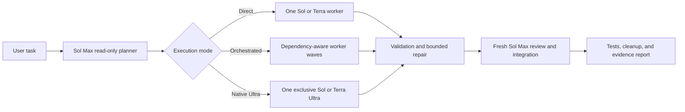

# Codex Auto Orchestrator

> Plan once. Route intelligently. Verify every model call.

[](https://www.python.org/)
[](LICENSE)
[](.codex-plugin/plugin.json)

**Codex Auto Orchestrator** is a local, evidence-backed model router for complex Codex tasks. It asks Sol Max to create a read-only structured plan, chooses between a single worker, parallel model-specific workers, or native Ultra coordination, then monitors execution, validates results, performs bounded repairs, and sends the finished work through an independent Sol Max review.

中文简介：这是一个面向 Codex 的自动模型编排插件。你只需要提交完整任务，它会自动判断是否拆分、选择 Sol 或 Terra、匹配推理等级、决定是否需要 Ultra，并在执行后完成验收、定向返工和最终整合。

## Why this project exists

Complex work is not improved merely by labeling subtasks with model names. Reliable orchestration also needs dependency-aware scheduling, permission boundaries, isolated write environments, failure classification, review gates, and proof that the model actually invoked matches the model written in the plan.

This project turns that full loop into a repeatable local workflow:



## Routing modes

| Mode | Best fit | Execution rule |
| --- | --- | --- |
| `direct` | One coherent, low-coupling task | Exactly one non-Ultra worker |
| `orchestrated` | Independent tasks with separate acceptance criteria | Up to three ordinary workers per wave, ordered by dependencies |
| `native-ultra` | Strongly coupled work that needs shared context and continuous replanning | Exactly one exclusive Sol Ultra or Terra Ultra worker |

Ultra is treated as a coordination mode, not as a generic retry level. Environment and permission failures never trigger a more expensive model automatically.

## Highlights

- **Sol Max planning:** every substantial job starts with a read-only, schema-constrained plan.
- **Dynamic model discovery:** available models and reasoning levels come from `codex debug models`, with cache data used only as a fallback.
- **Explicit routing:** workers launch with concrete model and reasoning arguments instead of relying on descriptive plan text.
- **Evidence-backed verification:** each invocation records requested and observed model selections and sets `actual_selection_verified` only when authoritative session evidence matches.
- **Dependency-aware concurrency:** ordinary tasks run in waves with a default maximum of three workers.
- **Bounded recovery:** implementation or reasoning failures receive targeted repair; environment and permission failures stop without wasting quota.
- **Safe write isolation:** parallel writers use independent Git worktrees and never push, deploy, or perform final merges themselves.
- **Windows read isolation:** executable read tasks use disposable snapshots with before-and-after content fingerprints.
- **Independent integration review:** multi-worker and medium-or-higher-risk jobs receive a fresh Sol Max review before delivery.
- **Operational controls:** start, inspect, cancel, and report jobs without running a resident service.

## Requirements

- Python 3.11 or newer
- An authenticated Codex CLI session
- Sol and Terra models exposed by `codex debug models`
- Git for isolated parallel write tasks

The runtime itself uses only the Python standard library.

## Quick start

Clone the repository:

```powershell
git clone https://github.com/wei-er582/codex-auto-orchestrator.git
cd codex-auto-orchestrator
```

Generate a plan without running workers:

```powershell
python scripts\orchestrate.py run `
  --workspace C:\path\to\project `
  --task "Audit the project, fix confirmed defects, run tests, and update documentation." `
  --dry-run
```

Run the complete workflow:

```powershell
python scripts\orchestrate.py run `
  --workspace C:\path\to\project `
  --task "Audit the project, fix confirmed defects, run tests, and update documentation."
```

Inspect, cancel, or summarize a job:

```powershell
python scripts\orchestrate.py status <job-id>
python scripts\orchestrate.py cancel <job-id>
python scripts\orchestrate.py report <job-id>
```

Use `--json` when another tool needs the final state as structured output.

## Codex plugin usage

The repository includes a Codex plugin manifest and the `auto-orchestrate-task` Skill. After registering this checkout in a local personal marketplace, install it with:

```powershell
codex plugin add codex-auto-orchestrator@personal
```

Start a new Codex task and use the explicit entry when orchestration must be forced:

```text
自动编排：<complete task>
```

The Skill can also trigger automatically for substantial tool-using tasks. Simple questions, translation, lightweight formatting, and one obvious command remain direct. Child workers carry an internal marker and run with plugins disabled to prevent recursive orchestration.

## Job artifacts

Runs are stored outside target repositories under `~/.codex/orchestrator/runs/<job-id>`.

| Artifact | Purpose |
| --- | --- |
| `plan.json` | Mode, waves, dependencies, models, reasoning, permissions, acceptance criteria, and escalation rules |
| `result-<task>.json` | Worker changes, tests, commits, blockers, uncertainty, and failure classification |
| `review.json` | Per-task acceptance, repair instructions, merge decision, and integration result |
| `state.json` | Durable lifecycle state and live child-process registry |
| `events.jsonl` | Raw Codex events used for debugging and model-selection evidence |
| `report.md` | Human-readable routing, results, blockers, and verification summary |

Lifecycle states are:

```text
planning → running → validating → reviewing → repairing
         → integrating → complete / blocked / cancelled
```

Run retention defaults to 14 days and at most 20 jobs.

## Safety model

- The orchestrator never expands the authority of the original task.
- Commit, push, deployment, and external writes remain disabled unless the task explicitly authorizes them.
- Dirty Git workspaces are inspected before writes; non-Git or dirty workspaces serialize write tasks.
- Unknown user changes are never reset or discarded.
- Ultra is exclusive and limited to one use per job.
- Temporary worktrees and snapshots are removed only when clean; changed isolation directories are preserved as evidence.
- Workers cannot invoke the plugin recursively or launch competing external Codex sessions.

## Validate the project

From the repository root:

```powershell
python -m compileall -q scripts tests
python -m unittest discover -s tests -v
python scripts\check_docs.py
git diff --check
```

The deterministic suite covers model discovery, schema validation, dependency ordering, concurrency limits, escalation rules, Windows argument handling, timeout and cancellation cleanup, fake Codex success and failure paths, Git worktree integration, Ultra exclusivity, and model evidence extraction.

## Project structure

```text
.codex-plugin/                 Plugin manifest
skills/auto-orchestrate-task/  Automatic Codex entrypoint and routing guidance
scripts/orchestrate.py         Command-line interface
scripts/orchestrator/          Planner, scheduler, runner, state, and workspace engine
scripts/schemas/               Strict plan, worker-result, and review schemas
tests/                         Deterministic fake-runner and lifecycle tests
docs/                          Product, architecture, configuration, release, and runbook docs
```

## Documentation

- [Implemented capabilities](docs/product/FUNCTIONS.md)
- [Architecture overview](docs/architecture/OVERVIEW.md)
- [Configuration reference](docs/reference/CONFIGURATION.md)
- [Development guide](docs/runbooks/DEVELOPMENT.md)
- [Testing guide](docs/runbooks/TESTING.md)
- [Deployment and rollback](docs/runbooks/DEPLOYMENT.md)
- [Architecture decisions](docs/architecture/adr/)
- [Release records](docs/releases/)

## Current scope

The first public version intentionally remains a local plugin and Python runtime. It does not require MCP, Hooks, a resident daemon, or a hosted control plane. Model availability and supported reasoning levels depend on the user's current Codex environment.

## License

Released under the [MIT License](LICENSE).
