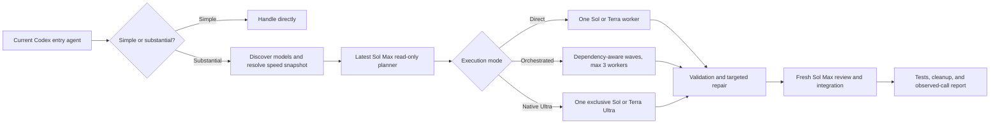

# Codex Auto Orchestrator

> Plan with Sol Max. Route every step. Control speed per model. Resume safely. Verify what actually ran.

[](https://www.python.org/)
[](LICENSE)
[](.codex-plugin/plugin.json)

**Codex Auto Orchestrator** is a local Codex plugin that turns a substantial request into an evidence-backed execution workflow. It discovers the currently available Sol and Terra models, resolves a complete per-model/per-reasoning Fast policy, asks the latest Sol Max to produce a read-only structured plan, chooses Direct, Orchestrated, or Native Ultra execution, monitors temporary workers, performs bounded repairs, and sends the result through an independent Sol Max review.

中文简介：提交完整任务即可。插件会自动判断是否拆分、选择 Sol 或 Terra、匹配推理等级、决定是否需要 Ultra，并为 Planner、Worker、返工、升级和 Reviewer 分别应用 Fast/普通配置。任务在后台临时控制器中运行，支持引导、调速、暂停、恢复、取消和完成后的关联后续任务。

## Why orchestration needs more than a prompt

Writing “use Sol Max here and Terra High there” does not prove that those calls happened. Reliable orchestration also needs dependency ordering, concurrency limits, immutable speed decisions, worktree isolation, process identity checks, resumable sessions, permission ceilings, failure classification, independent review, and runtime evidence.

This project implements that complete loop without a resident daemon, hosted control plane, MCP server, or Hook:



The model selected in the Codex UI handles only the initial message and the decision to enter orchestration. You do not need to switch the UI to Sol Max. The plugin explicitly starts its own Sol Max + Max planner.

## Execution modes

| Mode | Best fit | Rule |
| --- | --- | --- |
| `direct` | One coherent execution path | Exactly one ordinary Sol or Terra worker |
| `orchestrated` | Independent tasks with separate acceptance criteria | Dependency-ordered waves with at most three ordinary workers |
| `native-ultra` | Strong coupling, shared state, or continuous replanning | Exactly one exclusive Sol Ultra or Terra Ultra |

Ultra represents coordination complexity, not “one more reasoning level” after Max. Environment and permission failures never trigger a more expensive model.

## Per-model Fast profiles

Before the first model call, the plugin builds a dynamic matrix from `codex debug models`:

| Family | Low | Medium | High | XHigh | Max | Ultra |
| --- | --- | --- | --- | --- | --- | --- |
| Sol | Fast/Standard | Fast/Standard | Fast/Standard | Fast/Standard | Fast/Standard | Fast/Standard |
| Terra | Fast/Standard | Fast/Standard | Fast/Standard | Fast/Standard | Fast/Standard | Fast/Standard |

- Fast explicitly passes `service_tier="priority"`.
- Standard explicitly passes `service_tier="default"`.
- Unsupported cells are disabled.
- Planner and Reviewer use the Sol/Max cell.
- Escalation looks up the new model/reasoning cell again.
- Native Ultra uses Sol/Ultra or Terra/Ultra.
- Every job saves an immutable `speed-policy.json`; later global edits cannot change a running job.

Built-in templates are `balanced`, `all-fast`, `all-standard`, and `follow-entry`. The default `balanced` template enables Fast only for Sol Max, Sol Ultra, and Terra Ultra. First use requires creating a named user profile such as “Daily development” or “Urgent review”.

Ordinary orchestration uses the saved default without interrupting automation. The local matrix page opens only for first setup, newly discovered model cells, or an explicit per-job customization request. It listens on `127.0.0.1`, uses random request and CSRF tokens, never shows the task body, and exits after submission or ten minutes.

## Durable task controls

`start` launches one hidden temporary controller and immediately returns a `job_id`. There is no permanent service. Closing Codex does not cancel the controller, and a compatible Codex session can be resumed after interruption.

| Intent | Command |
| --- | --- |
| Inspect progress | `status` |
| Add guidance | `steer --mode add` |
| Replace direction and replan | `steer --mode replace` |
| Change Fast for later calls | `speed` |
| Pause or continue | `pause` / `resume` |
| Cancel safely | `cancel` |
| Start a linked task after completion | `followup` |
| Render the evidence summary | `report` |

Immediate controls may stop only read-only or isolated local workers. Integration, deployment, push, and uncertain external writes are never force-killed. Each controller holds a per-job lease, updates a heartbeat every two seconds, and exits on completion, cancellation, blocking, or after a paused idle timeout.

## Quick start

Requirements:

- Python 3.11 or newer
- Authenticated Codex CLI
- Sol and Terra exposed by `codex debug models`
- Git for clean-repository write isolation

The runtime uses only the Python standard library.

```powershell
git clone https://github.com/wei-er582/codex-auto-orchestrator.git
cd codex-auto-orchestrator
```

Put the full task in a UTF-8 file and start the background job:

```powershell
python scripts\orchestrate.py start `
  --workspace C:\path\to\project `
  --task-file C:\path\to\task.txt
```

On first use the result is `waiting_for_speed` with a local setup link. Complete the matrix once; only then will Sol Max planning begin.

Use a named profile or explicitly request a per-job page:

```powershell
python scripts\orchestrate.py start --workspace C:\project --task-file task.txt --speed-profile "Daily development"
python scripts\orchestrate.py start --workspace C:\project --task-file task.txt --custom-speed
```

Manage profiles:

```powershell
python scripts\orchestrate.py profiles list
python scripts\orchestrate.py profiles show "Daily development"
python scripts\orchestrate.py profiles configure
python scripts\orchestrate.py profiles copy balanced "Daily development"
python scripts\orchestrate.py profiles rename "Daily development" "Important review"
python scripts\orchestrate.py profiles set-default "Important review"
python scripts\orchestrate.py profiles delete "Daily development"
```

Guide and control a running job:

```powershell
python scripts\orchestrate.py status <job-id>
python scripts\orchestrate.py steer <job-id> --instruction-file guidance.txt --mode add
python scripts\orchestrate.py speed <job-id> --profile "Urgent"
python scripts\orchestrate.py pause <job-id>
python scripts\orchestrate.py resume <job-id>
python scripts\orchestrate.py cancel <job-id>
python scripts\orchestrate.py report <job-id>
```

Task and instruction text is passed through UTF-8 files or stdin, never interpolated into a shell command.

## Codex plugin usage

Install the personal plugin after registering this checkout in a personal marketplace:

```powershell
codex plugin add codex-auto-orchestrator@personal
```

Force orchestration with:

```text
自动编排：<完整任务>
```

The Skill may also enter automatically for substantial tool-using tasks. Simple answers, translation, lightweight formatting, and one obvious command remain in the current agent. During execution, normal follow-up messages become guidance; an explicit direction replacement triggers a new Sol Max plan; a message after completion becomes a linked job.

## Evidence and artifacts

Runs live under `~/.codex/orchestrator/runs/<job-id>`.

| Artifact | Purpose |
| --- | --- |
| `task.txt` | Original task body with checksum |
| `speed-policy.json` | Immutable model/reasoning-to-service-tier snapshot |
| `plan.json` and revisions | Execution mode, waves, models, reasoning, permissions, and acceptance criteria |
| `result-<task>.json` | Changes, tests, commits, blockers, uncertainty, and failure class |
| `review.json` | Per-task acceptance, targeted repair, merge decision, and integration result |
| `state.json` | Version 2 lifecycle, heartbeat, checkpoint, sessions, resources, and action fingerprints |
| `control.json` | Atomic pause/resume/steer/speed/cancel queue |
| `invocations/*/events.jsonl` | Raw Codex events |
| `invocations/*/invocation.json` | Requested settings, observed model/reasoning, CLI tier override proof, and any backend tier the CLI exposed |
| `report.md` | Human-readable routing, validation, Fast counts, and fallbacks |

Lifecycle states include:

```text
waiting_for_speed → planning → running → validating → reviewing
                  → repairing → integrating → complete / blocked / cancelled
paused or interrupted → resume from durable checkpoint
```

The report distinguishes four facts: requested settings, observed model/reasoning, the exact Service Tier override sent to the CLI, and any backend Service Tier that the CLI exposed. A call is accepted only when runtime evidence verifies the model and reasoning and the tier override is accounted for. If the backend tier is exposed, an exact match or Fast-to-Standard degradation is recorded. Codex CLI 0.144.0 does not expose the backend tier in normal JSON/session output, so those calls are honestly marked `not_exposed` rather than falsely labelled verified. A visible Fast rejection or degradation retries once as Standard without changing model or reasoning.

## Workspace and permission safety

- Direct, Orchestrated, and Native Ultra writes use isolated Git worktrees when the repository is clean.
- Dirty Git and non-Git workspaces serialize writes and keep fingerprints; unknown changes are never reset.
- Windows executable read tasks use disposable snapshots with content digests.
- Integration is idempotent. If the original branch advances elsewhere, automatic integration stops and preserves the integration worktree.
- One normalized workspace can have only one non-terminal job.
- Child processes disable plugins and carry an internal worker marker to prevent recursive orchestration.
- Push, deployment, and external writes require original user authority and action fingerprints. An uncertain outcome is reconciled read-only; only a proven `not_applied` result may be retried once.
- PID birth identity and job markers must both match before a process tree is terminated.

Run retention is fourteen days and at most twenty jobs. Clean temporary worktrees are removed immediately.

## Validate the project

```powershell
python -m compileall -q scripts tests
python -m unittest discover -s tests -v
python scripts\check_docs.py
git diff --check
```

The deterministic fake runner covers first setup, profiles, security checks, Fast and Standard calls, Fast fallback, routing, escalation, Ultra, background control, safe interruption, session resume, Git isolation, dirty-worktree protection, integration idempotence, cancellation, v0.1 compatibility, and evidence matching. Release acceptance also runs bounded real Codex smoke calls.

## Project structure

```text
.codex-plugin/                 Plugin manifest
skills/auto-orchestrate-task/  Automatic entry, control, and routing guidance
scripts/orchestrate.py         Public CLI and temporary-controller launcher
scripts/orchestrator/          Planner, scheduler, profiles, UI, state, runner, and workspace engine
scripts/schemas/               Plan, result, review, speed, config, control, and state schemas
tests/                         Deterministic fake runner and lifecycle tests
docs/                          Product, architecture, configuration, ADR, release, and runbook docs
```

## Documentation

- [Implemented capabilities](docs/product/FUNCTIONS.md)
- [Architecture overview](docs/architecture/OVERVIEW.md)
- [Configuration reference](docs/reference/CONFIGURATION.md)
- [Development guide](docs/runbooks/DEVELOPMENT.md)
- [Testing guide](docs/runbooks/TESTING.md)
- [Deployment and rollback](docs/runbooks/DEPLOYMENT.md)
- [Architecture decisions](docs/architecture/adr/)
- [Release records](docs/releases/)

## Scope

Version 0.2.0 remains deliberately local and inspectable. It does not need a permanent service, external web UI, MCP server, or Hook. Model and Fast availability are discovered from the user's current Codex installation instead of being frozen in the plugin.

## License

Released under the [MIT License](LICENSE).
